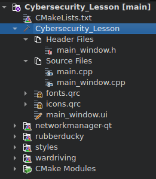
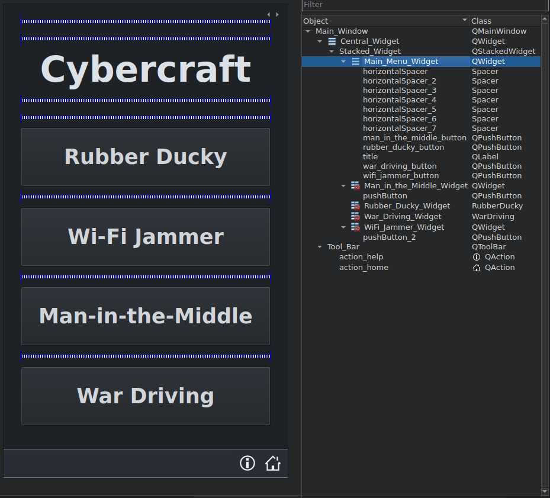

Main Window
=============
The toplevel cmake module contains two source files and is responsible for settings up the overall layout for the app.

*__Main Winodow Files__*

 *  main.cpp sets the style for the app and loads the main menu
 * main_window.cpp contains ui elements to navigate the app and access each attack

### *Main Window UI*

*__Main Winodow UI__*

The above layout is contained in the main_window.ui file.

 * The above menu provides four buttons for accessing each attack
 * The home button, located on the bottom right returns the user to the main menu.
 
 
### *Custom Widget UI*
 
 *__Custom Widget UI__*
 
The page above is one of four seperate pages for each attack

 * Each page acts a place holders for the attack's UI
     - This place holder is known as a Custom Widget.
  * The Custom Widget are defined in a seperate module denoted by the area enclosed in the red rectangle
      - For example, the UI for the Rubber Ducky Attack is found in the RubberDucky class

### *Main Window Programming*
Main Window is a central hub for accessing the different attacks. This module's focus is to setup general theme elements and load the Cyber Attack Pages when the respective button is pressed.

*__Main Window Class__*

~~~cpp
QT_BEGIN_NAMESPACE
namespace Ui
{
    class Main_Window;
}
QT_END_NAMESPACE

class Main_Window : public QMainWindow
{
    Q_OBJECT

public:
    explicit Main_Window (QWidget *parent = nullptr);
    ~Main_Window ();

private slots:
    void on_rubber_ducky_button_clicked ();

    void on_wifi_jammer_button_clicked ();

    void on_man_in_the_middle_button_clicked();

    void on_war_driving_button_clicked();

    void on_action_home_triggered();

private:
    Ui::Main_Window *ui;

    QFont title_font = QFont("DejaVuSerif", 45, QFont::Bold);
    QFont button_font = QFont("DejavuSans", 26, QFont::Bold);

    CustomStyleSheets *stylesheets;
    QString main_window_stylesheet();

    void setup_fonts (void);
    void setup_main_menu (void);
};

#endif // MAIN_WINDOW_H
~~~

*__Main Window Setup__*

~~~cpp
Main_Window::Main_Window (QWidget *parent)
    : QMainWindow (parent),
      ui (new Ui::Main_Window),
      stylesheets (new CustomStyleSheets)
{
    ui->setupUi (this);

    // Embed fonts
    setup_fonts();

    // Set Main Menu fonts
    setup_main_menu();

    /* Set global style sheets
    **     Background color
    **     Button font color
    **     Scrollbar colors
    */
    ui->Central_Widget->setStyleSheet (main_window_stylesheet()
                                       + stylesheets->vertical_scrollbar()
                                       + stylesheets->horizontal_scrollbar());

    // Set starting point to main menu
    ui->Stacked_Widget->setCurrentIndex (0);

    // Ensures index is set properly
    QTimer *timeout = new QTimer();
    timeout->setSingleShot(true);
    timeout->setInterval(500);

    timeout->start();
    while (ui->Stacked_Widget->currentIndex() != 0)
    {
        ui->Stacked_Widget->setCurrentIndex (0);

        if (!timeout->remainingTime())
        {
            timeout->stop();
            break;
        }
    }
    delete timeout;
}
~~~

The code above calls a series of functions to setup up the main menu ui. 

 * We used [Qt Style Sheets](https://doc.qt.io/qt-6/stylesheet.html) to implement some of the apps global colors including the background color for the app, the font color for push buttons, and the scrollbar colors
 * The main menu is setup as a stacked widget. The first page in the stack is the main menu, while the other pages represent place holders for the Cyber Attacks.
     - The setCurrentIndex() call ensures the app starts at the main menu. The same function will be used later to switch to the other Cyber Attack pages.
     - The App occasionally opens on a page other than the main menu. The while loop checks to ensure the index is set correctly. The timeout is to prevent the possibility of entering the loop indefinitely. 
 
 *__UI Functions__*
 
~~~cpp

/*
* Setup UI
*/
void Main_Window::setup_fonts (void)
{
    // Add Dejavu fonts
    QFontDatabase::addApplicationFont (":/fonts/dejavu/DejauSerif.ttf");
    QFontDatabase::addApplicationFont (":/fonts/dejavu/DejaVuSans.ttf");

    // Add Liberation fonts
    QFontDatabase::addApplicationFont (":/fonts/liberation/LiberationSans-Bold.ttf");
}

void Main_Window::setup_main_menu (void)
{
    // Set Title Font
    ui->title->setFont (QFont("DejaVuSerif", 45, QFont::Bold));

    // Set Main Menu Button Fonts
    ui->rubber_ducky_button->setFont (QFont("DejavuSans", 26, QFont::Bold));
    ui->wifi_jammer_button->setFont (QFont("DejavuSans", 26, QFont::Bold));
    ui->man_in_the_middle_button->setFont (QFont("DejavuSans", 26, QFont::Bold));
    ui->war_driving_button->setFont (QFont("DejavuSans", 26, QFont::Bold));
}

QString Main_Window::main_window_stylesheet()
{
    // Set background color and button font color
    QString stylesheet =
    "* { background-color: rgb(30, 34, 39); } \
     QPushButton { color: rgb(209, 213, 218); }";

    return stylesheet;
}
~~~

The contents of the functions above are responsible for configuring the Main Window's UI. 

 * The setup_fonts() function embed Dejavu and Liberation fonts into the app executable, rather than relying on the OS to provide the fonts. This to avoid some unusual behavior with aliasing on the fonts, when launching the app on a raspberrypi 4.
 * The setup_main_menu() function sets the font type and size for each ui element on the main menu
 * The main_window_stylesheet() function contains style sheets for the apps background color and the fon color for QPushButtons
 
*__Menu Navigation w/ Qt Slots__*

~~~cpp
void Main_Window::on_man_in_the_middle_button_clicked ()
{
    ui->Stacked_Widget->setCurrentIndex(1);
}

void Main_Window::on_wifi_jammer_button_clicked ()
{
    ui->Stacked_Widget->setCurrentIndex(2);
}

void Main_Window::on_rubber_ducky_button_clicked ()
{
    ui->Stacked_Widget->setCurrentIndex(3);
}

void Main_Window::on_war_driving_button_clicked ()
{
    ui->Stacked_Widget->setCurrentIndex (4);
}

void Main_Window::on_action_home_triggered ()
{
    ui->Stacked_Widget->setCurrentIndex (0);
}
~~~
Those familiar with programming may be acquainted with the term interupts and callback functions. Instead of using callbacks, Qt has opted to use it's own programming concept for communicating between objects, called [Signals & Slots](https://doc.qt.io/qt-6/signalsandslots.html).

 * When a button is pressed, it emits a signal. This signal is then received by the on_button_clicked() functions above. These functions call setCurrentIndex() to load the respective Cyber Attack page.
 *  Each signal can be associated with more than one slot as shown below. See Qt's documentation for more details.
 ;